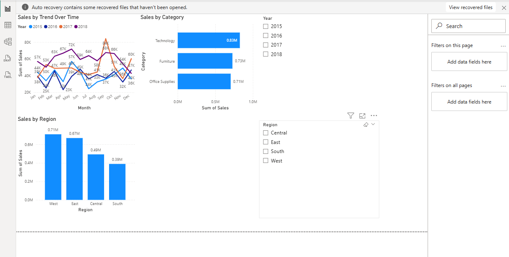

📊 Retail Sales Performance Dashboard

This project analyzes retail sales data using Excel and Power BI.

🔧 Tools Used
Excel (data cleaning & transformation)
Power BI (dashboard & visualization)
📈 Key Insights
Technology is the top-performing category
West and East regions generate the highest sales
Sales trends show consistent patterns across months and years
📷 Dashboard Preview

